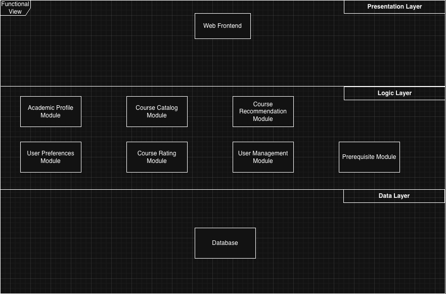
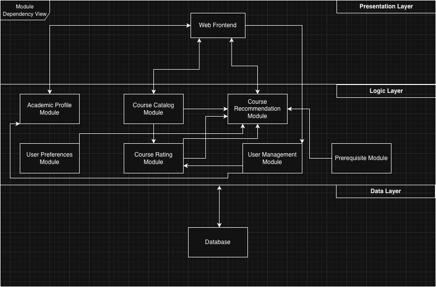
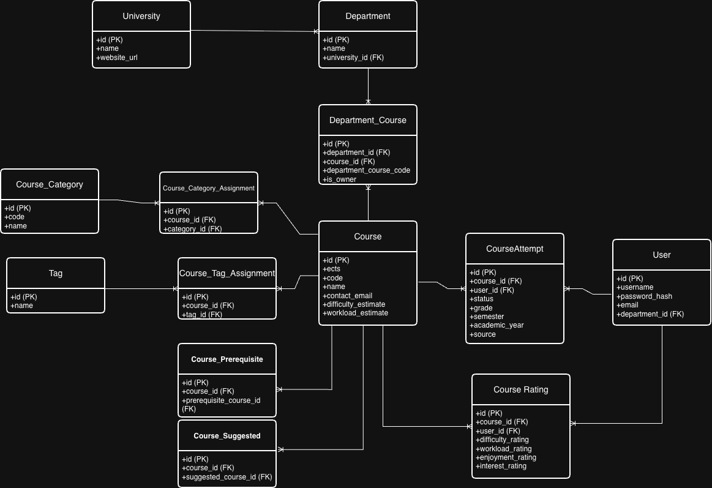

# Academic Advisor

An academic decision-support system that recommends courses and academic paths based on completed courses, ratings, workload tolerance, interests, prerequisites, degree constraints, and career goals.

## Current Status

Early-stage development. The project currently contains a containerized FastAPI backend used for experimenting with API structure, validation, and backend architecture before implementing the main recommendation system. Students already use AI manually to research courses and plan their academic path. AcademicAdvisor turns that into a structured, data-driven advising system.

## API Documentation

The current course catalog endpoints are documented in
[docs/api/courses.md](docs/api/courses.md).

When the backend is running, FastAPI also provides interactive documentation:

- Swagger UI: `http://localhost:8000/docs`
- ReDoc: `http://localhost:8000/redoc`

## Planned Stack for V1

- FastAPI
- PostgreSQL
- Docker
- Next.js

### Later

- Agentic tooling layer
- Redis

## V1 Scope

The first version focuses on the core academic planning engine:

- Course catalog
- Academic profile with completed/failed/in-progress courses
- User preferences and goals
- Course ratings
- Prerequisite and eligibility checks
- Deterministic course recommendations
- Rule-based recommendation explanations
- ECTS progress ring showing completed credits toward the overall degree target

The V1 progress ring is an ECTS-only progress indicator and does not perform full degree-audit validation.

Later versions will support multiple progress rings for requirement categories such as core courses and electives.

## Post-V1 / Pre-Production Scope

- Degree Constraints Module for validating program requirements, required courses, elective rules, ECTS requirements, category limits, thesis requirements, and graduation progress.

## Planned V1 Architecture

### Functional View

The diagram above showcases the planned modules for V1 of this project. As this is web based, a mobile UI will be planned for a future version. The main purpose of V1 is to build the foundations for the main project and to learn the stack better. However this is subject to change in the future.

### Module Dependency View

This diagram showcases the dependencies between each module. The database arrow points only to the border of the logic tier to avoid bloat. It shows how each module read/writes on the DB.

## ER Diagram

The ER diagram above shows the current planned database schema for the project. It supports the course catalog, course ratings, user course attempts, recommendation-related data, and separate university/department modeling.

Prerequisites and suggested course relationships are modeled through dedicated relationship tables instead of raw fields on the course record.
